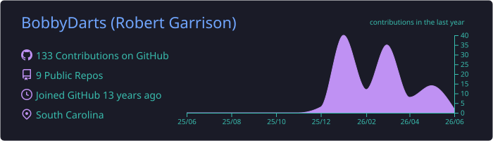
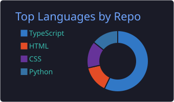
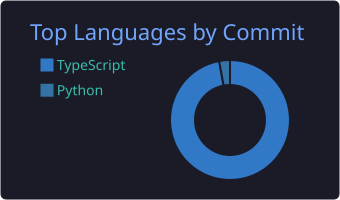
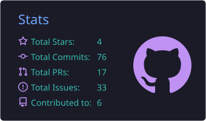
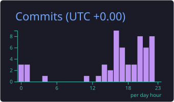

# 👋 Hey, I'm Bobby!

### 🎯 Software Engineer | Problem Solver | Builder of Things

---

## 🚀 What I'm Up To

- 🔨 Building **[Job Hunt Daily](https://github.com/BobbyDarts/job-hunt-daily)** - A daily job hunting tracker with ATS detection
- 🌱 Learning advanced Vue patterns and composables
- 💡 Exploring better ways to write clean, maintainable code

---

## 📊 GitHub Stats

---

## 🛠️ Tech Stack

### Frontend

### Tools & Dev

---

## 📈 Contribution Graph

---

## 💼 Featured Projects

---

## 📫 Let's Connect

---

### 💭 Random Dev Quote

### 👀 Profile Views

---

_"Code is like humor. When you have to explain it, it's bad." – Cory House_

